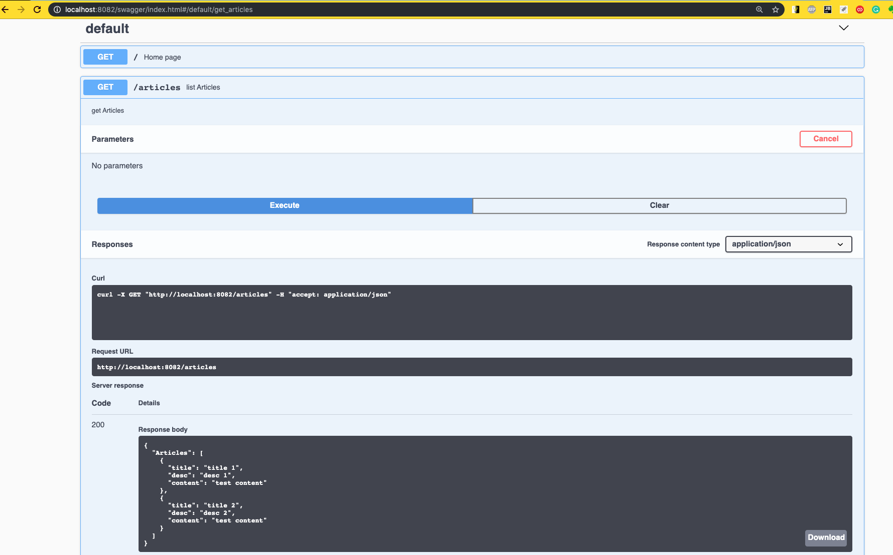

# Description
An example of using swagger console with gorilla/mux rest.


# Process 

- step 1: Comment annotate main and handler methods with swagger comments https://github.com/swaggo/swag#declarative-comments-format.
- step 1.1: Download swag by using: `$ go get -u github.com/swaggo/swag/cmd/swag`
- step 2: swag init -g main.go
    - this will generate docs folder and swagger json in it
    - import it e.g. _ "github.com/ajit-go/swaggerexample/docs"
- step 3: host swagger with "github.com/swaggo/http-swagger"


# Running the example
```zsh
go get -u github.com/ajit-go/swaggerexample
cd $GOPATH/src/github.com/ajit-go/swaggerexample 
go run main.go or fresh
```
# Generating the go docs
```zsh
go get github.com/swaggo/swag/cmd/swag
swag init
swag init -g router.go //if its not main.go
```
this generates swagger json and init fucntion in {approot}/docs folder

# Serving the swagger console
```zsh
go get -u github.com/gorilla/mux
go get -u github.com/swaggo/http-swagger
import "github.com/ajit-go/swaggerexample/docs"
```

# Swagger annotations
https://github.com/swaggo/swag

# Using fresh 
Fresh reloads the rest app automatically on each file change (https://github.com/gravityblast/fresh)
How to:
```zsh
go get github.com/pilu/fresh
```

just run `fresh` in app root
Any compile/runtime exceptions are logged in dynamically generated file: 
```zsh
{approot}/tmp/runner-build-errors.log
```

# Know how
-  _ import statements prefixed with an ubnderscore.
    - This means, import package, create package-level variables and execute the init function of that package. It is used for side effects such as init scripts etc.
- There are some tricks in import declaration, for example by doing:

        import m "container/list"
        You could refer to the exported identifiers with "m.Identifiername", e.g.

        l := m.New()
        Also by doing:

        import . "container/list"
        You can leave out the package name completely:

        l := New()

# Running tests
        This should run all tests in current directory and all of its subdirectories:

        $ go test ./...
        This should run all tests with import path prefixed with foo/:

        $ go test foo/...
        This should run all tests import path prefixed with foo:

        $ go test foo...
        This should run all tests in your $GOPATH:

        $ go test ...
        go test -cover ./...
        go test $(go list ./... | grep -v /archive/)
# links
- https://stackoverflow.com/questions/51456253/how-to-set-http-responsewriter-content-type-header-globally-for-all-api-endpoint
- https://labs.bawi.io/documenting-an-api-with-swagger-cb106250239f
- https://github.com/swaggo/http-swagger/issues/3
- https://github.com/swaggo/swag


- https://semaphoreci.com/community/tutorials/building-and-testing-a-rest-api-in-go-with-gorilla-mux-and-postgresql
- https://tutorialedge.net/golang/creating-restful-api-with-golang/
- https://github.com/gorilla/mux
- https://codeburst.io/unit-testing-for-rest-apis-in-go-86c70dada52d